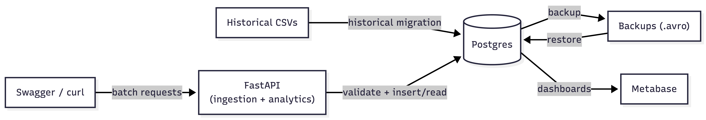

## Data Challenge for Globant

A small data-engineering PoC: historical CSV migration into Postgres, a REST API for validated ingestion, SQL-backed analytics endpoints, AVRO backup/restore, and a BI dashboard on top.

### Architecture



### Stack

- **uv** for dependency management, **FastAPI** + **SQLAlchemy** for the API/ORM.
- **Postgres 16** (Docker) for storage; raw parametrized SQL (not ORM) for the two analytics endpoints, since SQL correctness is explicitly evaluated.
- **fastavro** for backup/restore, **rich** for logging, **Metabase** for dashboards.
- **ruff** (lint + format) and **pytest**, wired into GitHub Actions on every push/PR.

### Setup

```bash
cp .env.example .env          # adjust credentials if needed
docker compose up -d          # Postgres + Metabase
uv sync                       # install dependencies

python -m scripts.init_db          # create tables
python -m scripts.ingest_historical # migrate CSVs (validates + rejects bad rows)
uvicorn app.main:app --reload --port 8000
```

Metabase: http://localhost:3000 — when connecting to Postgres, use host `postgres` (the compose service name), not `localhost`.

### Ingestion API

Batch endpoints (1-1000 rows), reject non-compliant records without inserting them and log the rejection to `logs/rejected_<table>.log`:

- `POST /departments`
- `POST /jobs`
- `POST /hired-employees`

Validation rules: all fields required, `datetime` must be ISO 8601, `department_id`/`job_id` must exist.

### Analytics API

Both computed via SQL, filtered to 2021, using only records that passed validation:

- `GET /analytics/hires-by-quarter` — hires per department/job, columns `Q1..Q4`.
- `GET /analytics/departments-above-average` — departments hiring above the 2021 average.

### Backup / Restore

```bash
python -m scripts.backup            # exports all tables to backups/*.avro
python -m scripts.restore --all     # restores all tables, in dependency order
python -m scripts.restore <table>   # restores a single table (fails if referenced by data not yet cleared)
```

### Dev

```bash
uv run ruff format --check .
uv run ruff check .
uv run pytest -v
```
